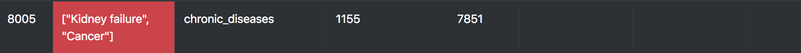
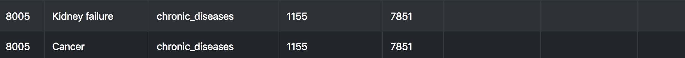

# CSV-parser

#Features

* Parse CSV to JSON
* Normalize data: 
  * Currently, able to parse rows and find de-normalized cells (atm cells containing arrays) and create new normalized rows.
  * Example, if cell has an array (de-normalized data) with 2 values:
  
  * It will create 2 new rows and delete the de-normalized row:
  
* Export JSON back to CSV

#Resources

* Demo site: <a href="https://github.com/alexitaylor/gatsby-boilerplate" target="_blank">GatsbyJS Boilerplate</a>
* Built by 👨‍💻 <a href="https://alexitaylor.com" target="_blank">alexi taylor</a>
* Delivered by 🚀 <a href="https://zeit.co/dashboard" target="_blank">Zeit</a>
* Site Developed using <a href="https://www.papaparse.com/" target="_blank">Papa Parser</a>
